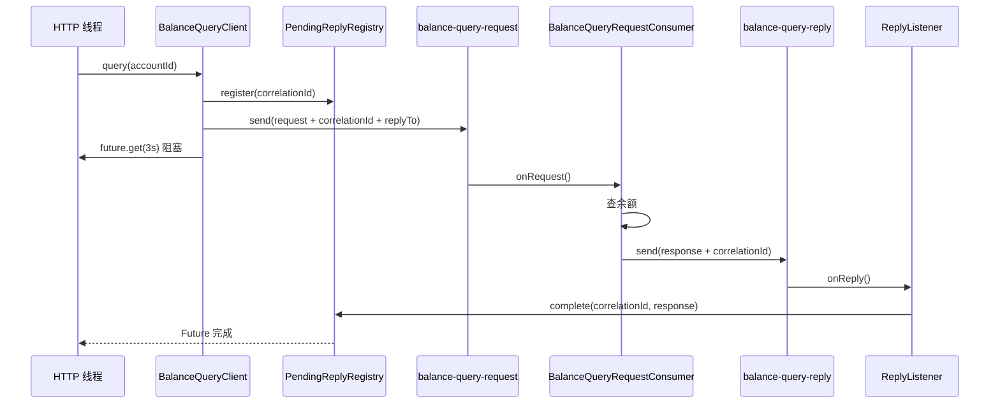

# Kafka-RequestReply

Kafka Request-Reply 学习模块：用「账户余额查询」最小场景演示 request topic + reply topic + `correlationId` 的完整链路，并覆盖超时、业务错误响应与重复 reply 丢弃。

## 设计思想

**Request-Reply 是应用层协议，不是 Kafka 内置能力。**

Kafka 只负责异步投递消息；「一问一答」的配对、等待、超时由调用方在内存中自行实现。本模块用 `PendingReplyRegistry`（`correlationId → CompletableFuture`）完成配对，用 `ReplyListener` 把 Kafka 上的 reply 消息桥接回 Java Future。

单进程内同时包含**调用方（client）**与**处理方（server）**，用于模拟两个微服务之间的交互；拆成独立部署后，协议与代码结构无需改变。

```
HTTP Client
    → BalanceQueryController
    → BalanceQueryClient（发 request + 注册 Future + 同步等待）
        → balance-query-request
    → BalanceQueryRequestConsumer（查内存余额 + 发 reply）
        → balance-query-reply
    → ReplyListener（收 reply + complete Future）
    ← Controller 返回 JSON
```

## 角色划分

本模块有两套 Consumer Group，对应两个逻辑角色：

| 角色 | 组件 | Consumer Group | 职责 |
|------|------|----------------|------|
| **调用方（上游 / client）** | `BalanceQueryClient`、`ReplyListener`、`PendingReplyRegistry` | `balance-query-client-group` | 发请求、注册 Future、消费 reply、完成等待 |
| **处理方（下游 / server）** | `BalanceQueryRequestConsumer`、`InMemoryAccountBalanceStore` | `balance-query-server-group` | 消费 request、执行业务、发 reply |

`ReplyListener` 属于**调用方**，不是处理方。处理方完成后不会、也无法直接操作调用方 JVM 里的 `CompletableFuture`。

## 为什么需要 ReplyListener？

常见疑问：处理方消费 request 后已经得到结果，为什么不直接在 request 消费者里 `complete` Future，而要再发一条 reply 消息给 `ReplyListener`？

**因为 Kafka 是单向异步消息总线，不是 RPC 框架。**

1. **跨进程传递** — 生产环境中调用方与处理方通常是两个独立服务。处理方拿不到调用方内存里的 `PendingReplyRegistry`，只能通过 Kafka 把响应发回去。
2. **协议约定** — 处理方只负责：读 request → 执行业务 → 写 reply（携带相同 `correlationId`）。它不需要知道调用方是 HTTP、定时任务还是别的入口。
3. **ReplyListener 的职责很薄** — 读 header、反序列化 body、`pendingReplyRegistry.complete(...)`。它不是在「再组装一遍业务结果」，而是把 **Kafka 异步消息** 转成 **Java 内存里的 Future 完成信号**。
4. **职责分离** — 业务成功 / 账户不存在 / 处理异常 → 处理方统一写成 reply 消息；超时、HTTP 状态码映射 → 调用方（Controller + `GlobalExceptionHandler`）负责。

本 demo 虽在同一 JVM，仍保留 reply topic + `ReplyListener`，是为了贴近真实分布式部署；若在同一进程里让 request 消费者直接 `complete`，上线拆服务后会立刻失效。

### 运行时序



## 消息协议

### Topic

| 名称 | 常量 | Consumer Group |
|------|------|----------------|
| Request | `balance-query-request` | `balance-query-server-group` |
| Reply | `balance-query-reply` | `balance-query-client-group` |

Topic 常量：`com.kafkalearn.config.KafkaTopic`

### Record Headers

| Header | 说明 |
|--------|------|
| `correlationId` | 调用方生成的 UUID，reply 原样带回，用于配对 |
| `replyTo` | 响应目标 Topic，默认 `balance-query-reply` |
| `simulateDelayMs` | 可选，仅用于 L3 超时测试 |

### Request Body（JSON）

```json
{
  "accountId": "11111111-1111-1111-1111-111111111111",
  "requestedAt": 1710000000000
}
```

### Response Body（JSON）

```json
{
  "accountId": "11111111-1111-1111-1111-111111111111",
  "balance": 100.00,
  "status": "SUCCESS",
  "message": null,
  "respondedAt": 1710000001000
}
```

`status` 枚举：`SUCCESS` | `NOT_FOUND` | `ERROR`

### 预置账户（内存）

| accountId | balance |
|-----------|---------|
| `11111111-1111-1111-1111-111111111111` | 100.00 |
| `22222222-2222-2222-2222-222222222222` | 250.50 |
| `33333333-3333-3333-3333-333333333333` | 0.00 |

## 核心类职责

```
Kafka-RequestReply/src/main/java/com/kafkalearn/
├── KafkaRequestReplyApplication.java       # 启动类
├── config/
│   ├── KafkaTopic.java                     # Topic 常量
│   ├── KafkaProperties.java                # spring.kafka 配置绑定
│   └── KafkaAutoConfiguration.java         # Producer / Consumer / Template
├── message/
│   ├── BalanceQueryRequest.java
│   ├── BalanceQueryResponse.java
│   ├── BalanceQueryResult.java
│   ├── ReplyStatus.java
│   └── KafkaHeaderNames.java
├── codec/
│   ├── BalanceQueryRequestCodec.java
│   └── BalanceQueryResponseCodec.java
├── client/                                 # 调用方
│   ├── PendingReplyRegistry.java           # correlationId → CompletableFuture
│   ├── ReplyListener.java                  # 消费 reply topic，complete Future
│   └── BalanceQueryClient.java             # 发 request + future.get(timeout)
├── server/                                 # 处理方
│   ├── InMemoryAccountBalanceStore.java
│   └── BalanceQueryRequestConsumer.java
├── controller/
│   └── BalanceQueryController.java
└── exception/
    ├── ReplyTimeoutException.java
    └── GlobalExceptionHandler.java
```

## 用到的 Kafka 特性

| 特性 | 本模块用法 |
|------|------------|
| 双 Topic | request / reply 分离 |
| Header | `correlationId`、`replyTo` 携带协议元数据 |
| Producer | `KafkaTemplate` + JSON 字符串 payload |
| Consumer | 两个 `@KafkaListener`，不同 Consumer Group |
| 可靠性 | `acks=all`、`enable-idempotence: true` |
| 手动 ack | `enable-auto-commit: false`，`ack-mode: record` |
| 应用层配对 | `PendingReplyRegistry` + `CompletableFuture` |

**未涉及**：`ReplyingKafkaTemplate`、每实例独立 reply topic、Outbox、DLQ、EmbeddedKafka 集成测试。

## 运行

```bash
docker compose up -d   # 项目根目录，需 Kafka 已启动

cd Kafka-RequestReply
mvn spring-boot:run
```

主类：`com.kafkalearn.KafkaRequestReplyApplication`

默认端口：`8081`（环境变量 `APP_SERVER_PORT`）

## HTTP API

```
GET /api/accounts/{accountId}/balance?simulateDelayMs=0
```

**成功示例（200）：**

```json
{
  "accountId": "11111111-1111-1111-1111-111111111111",
  "balance": 100.00,
  "status": "SUCCESS",
  "message": null,
  "correlationId": "...",
  "elapsedMs": 42
}
```

**超时（504）：** `simulateDelayMs` 大于客户端等待时间（当前硬编码 3000ms）

```json
{
  "status": "TIMEOUT",
  "message": "Reply timed out for correlationId=..., timeoutMs=3000"
}
```

## 学习场景（L1–L5）

| 编号 | 场景 | 触发方式 | 期望 |
|------|------|----------|------|
| L1 | 正常查询 | `GET .../11111111-1111-1111-1111-111111111111/balance` | HTTP 200，`status=SUCCESS`，余额 100.00 |
| L2 | 账户不存在 | 查询未知 UUID | HTTP 200，`status=NOT_FOUND` |
| L3 | 超时 | `?simulateDelayMs=10000` | HTTP 504，`ReplyTimeoutException` |
| L4 | 重复 reply 丢弃 | 同一 `correlationId` 完成两次 | 第二次 `complete` 返回 `false`，Future 不重复完成 |
| L5 | 日志可追踪 | 任意 L1 请求 | request / reply 日志含相同 `correlationId` |

**L1 curl：**

```bash
curl "http://localhost:8081/api/accounts/11111111-1111-1111-1111-111111111111/balance"
```

**L2 curl：**

```bash
curl "http://localhost:8081/api/accounts/99999999-9999-9999-9999-999999999999/balance"
```

**L3 curl：**

```bash
curl -i "http://localhost:8081/api/accounts/11111111-1111-1111-1111-111111111111/balance?simulateDelayMs=10000"
```

## 关键配置

| 环境变量 | 默认值 | 说明 |
|----------|--------|------|
| `APP_SERVER_PORT` | `8081` | HTTP 端口 |
| `APP_KAFKA_BOOTSTRAP_SERVERS` | `172.28.183.183:9092` | Kafka 地址 |

客户端 reply 等待超时：当前在 `BalanceQueryClient` 中硬编码为 **3000ms**。

## 与仓库其他模块的对比

| 模块 | 对比 |
|------|------|
| PointToPoint | 处理方多实例竞争消费 request topic，无 reply |
| EventDriven | 单向事件，无 reply |
| FanOut | 一对多广播，无 reply |
| Outbox | 若「写库后发 request」需一致，可后续扩展 |
| EventSourcing | 命令可走 Kafka，本模块用内存余额，不依赖 ES |

## 与 HTTP/gRPC 的对比

| | HTTP/gRPC | Kafka Request-Reply |
|--|-----------|---------------------|
| 连接 | 同步、点对点 | 异步、经 Broker |
| 响应路径 | 同连接返回 | 必须走 reply topic |
| 谁完成等待 | 框架 / Socket | 调用方 `ReplyListener` + `PendingReplyRegistry` |
| 适用 | 强实时 RPC | 削峰、解耦、已有 Kafka 生态的跨服务查询 |

## 生产环境进阶（本模块未实现）

1. **多调用方实例** — 固定 reply topic + 共享 Consumer Group 时，reply 可能被其他实例消费，导致 `matched=false` 与超时。常见做法：每实例独立 reply topic（`replyTo` header 指向实例专属 topic），或使用 Spring `ReplyingKafkaTemplate`。
2. **ReplyingKafkaTemplate** — Spring Kafka 内置的请求-响应抽象，可对比手写版理解原理。
3. **Outbox 联动** — 写库与发 request 同事务，保证一致性。
4. **处理方失败进 DLQ** — 请求方收到 `status=ERROR` 或超时。

## 学到了什么

- Request-Reply 是**应用层协议**：Kafka 不理解 request/response，只认 Topic + Record。
- **调用方**负责：`correlationId` 生成、`PendingReplyRegistry` 注册、`ReplyListener` 收 reply、`future.get(timeout)` 等待。
- **处理方**负责：消费 request、执行业务、发 reply；**不碰**调用方的 Future。
- `ReplyListener` 存在是因为 Kafka 无法跨进程直接回调内存，reply topic 是响应回传的唯一通道。
- 业务错误（如 `NOT_FOUND`）通过 reply 消息表达，超时由调用方本地等待逻辑触发，两者是不同层面的失败。
- 单进程 demo 与双服务部署共享同一套 Topic / Header / 配对协议，便于从学习平滑过渡到真实架构。
